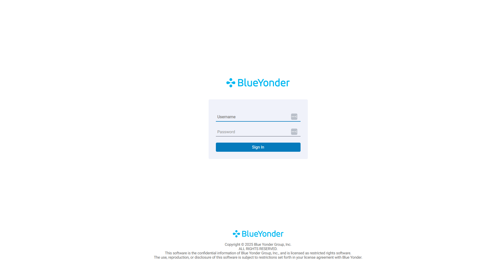
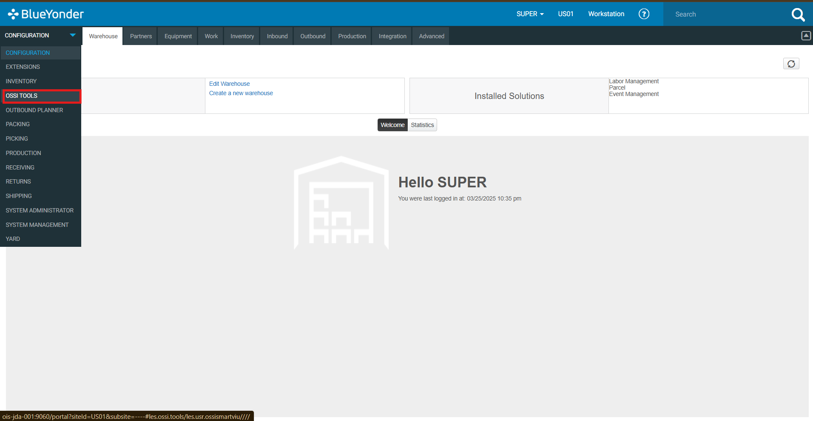
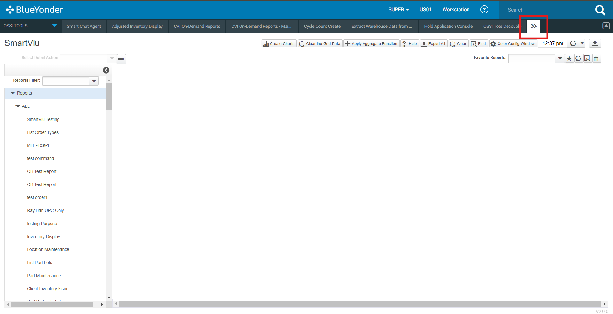
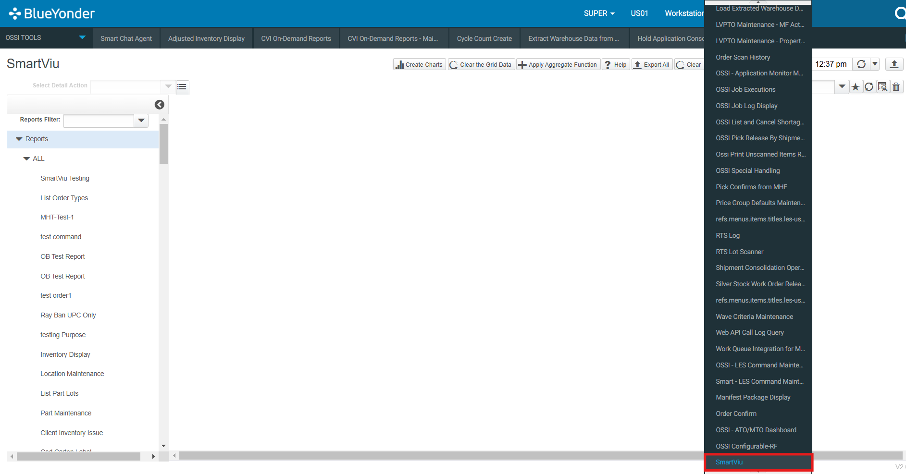

# Getting Started with SmartViu
Get started with **SmartViu** today and enhance your Blue Yonder WMS experience!

## System Requirements

To use SmartViu, ensure that your system meets the following requirements:

| Requirement                | Minimum Specification     |
|----------------------------|---------------------------|
| Web Browser                | latest version               |
| Internet Access            | stable internet connection   |
| Blue Yonder WMS Credentials| Authorized login credentials |

## Accessing SmartViu

Follow these steps to access SmartViu:

1. **Log in to Blue Yonder Portal:** Navigate to the BY Portal in browser (Chrome, Edge, Firefox, etc.)and enter your credentials.

    

2. **Access OSSI Tools:** In the portal, locate and open the **OSSI Tools** Menu.

    

3. **Open SmartViu:** Click to expand the OSSI TOOL Menu bar and click SmartViu to launch it.

    

    

Once logged in, you will have access to all the functionalities and tools SmartViu provides for seamless screen development and management.
