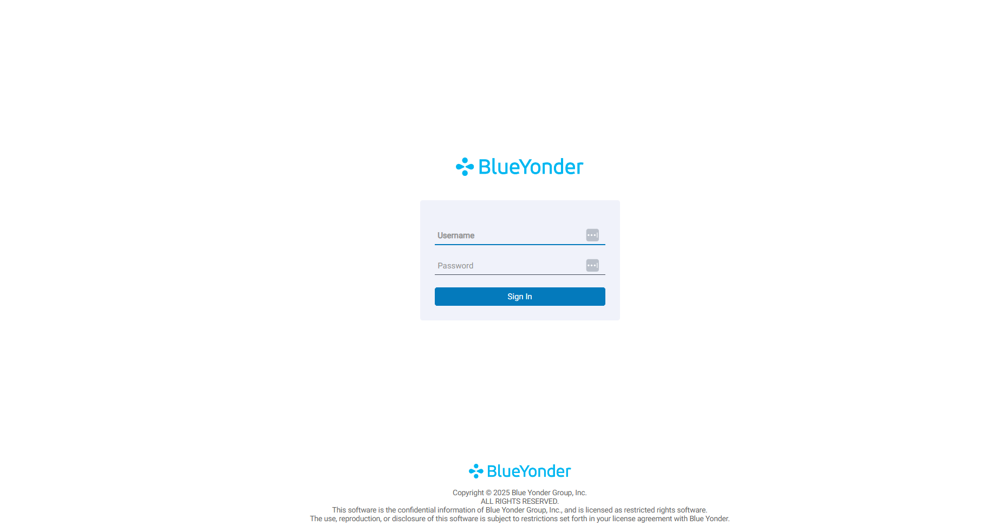
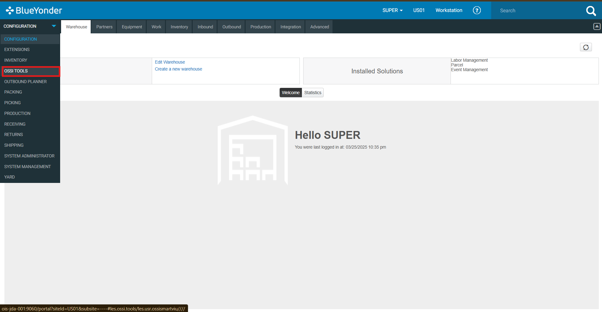
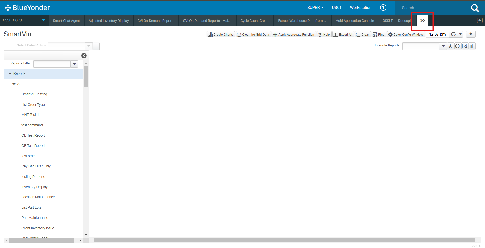
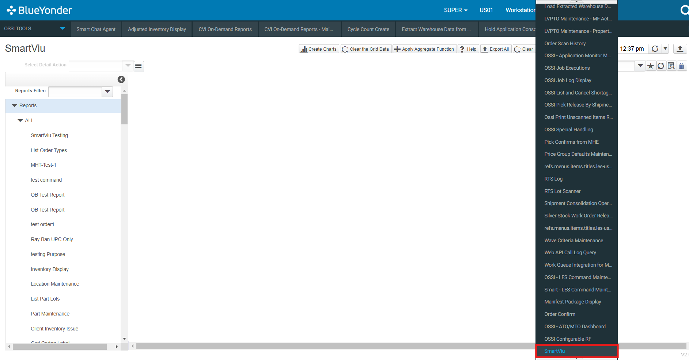

# Getting Started with SmartViu

## System Requirements

To use SmartViu, ensure that your system meets the following requirements:

- **Web Browser:** Use the latest version for the best experience.
- **Internet Access:** A stable internet connection is required.
- **Blue Yonder WMS Credentials:** Authorized login credentials are necessary to access SmartViu.

---

## Accessing SmartViu

Follow these steps to access SmartViu:

1. **Open Web Browser:** Launch your preferred browser (Chrome, Edge, Firefox, etc.).
2. **Log in to Blue Yonder Portal:** Navigate to the BY Portal and enter your credentials.

3. **Access OSSI Tools:** In the portal, locate and open the OSSI Tools Menu.

4. **Open SmartViu:** Click to expand the OSSI TOOL Menu bar.

5. **Open SmartViu:** Click SmartViu to launch it.

Once logged in, you will have access to all the functionalities and tools SmartViu provides for seamless screen development and management.

---  

Get started with **SmartViu** today and enhance your Blue Yonder WMS experience!

