# SmartViu Bundles

## Overview

SmartViu consists of two main screens: the Maintenance Screen and the SmartViu Screen.

### LES Command Maintenance Screen

This screen is used primarily by administrators or users with the appropriate roles to manage LES commands. It allows for the creation, updating, deletion, and assignment of roles to LES commands. This is the backbone of how reports are managed within SmartViu.

### SmartViu Screen

This screen is used by end-users to view and interact with the reports that have been set up in the Maintenance Screen. It provides a user-friendly interface for viewing report lists, performing actions on grid data, and visualizing report details with enhanced data visualization features such as grid coloring.

These two screens work together to provide a comprehensive solution for managing and interacting with reports in a Blue Yonder WMS environment.

## LES Command Maintenance Screen

In the Maintenance Screen, LES commands are defined and managed. These commands control various aspects of report management, including creation, updating, and role assignments to LES Commands.

### LES CMD Script Format

#### How to Write Scripts

Users need to follow the below format when writing for all three main, action, and detail LES Commands.

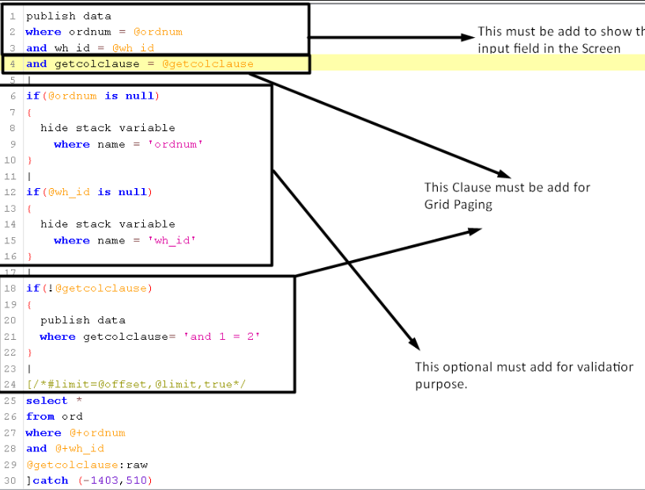

#### Main Commands

Main commands are the primary instructions used to manage LES commands within SmartViu. Users must define the main command with the above-mentioned format. Users also follow the format for defining each main command ID such as `<Main-CMD>`.

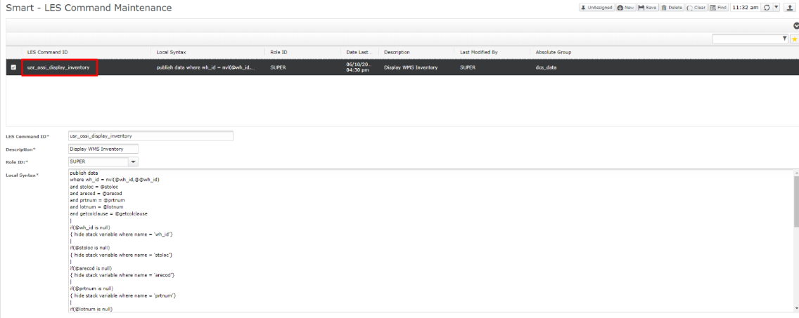

#### Detail Commands

Detail commands provide additional configuration and details for each main command. They extend the functionality and customization of main commands. The format for a detail command ID is typically `<Main-CMD>-D-1`, `<Main-CMD>-D-2`.

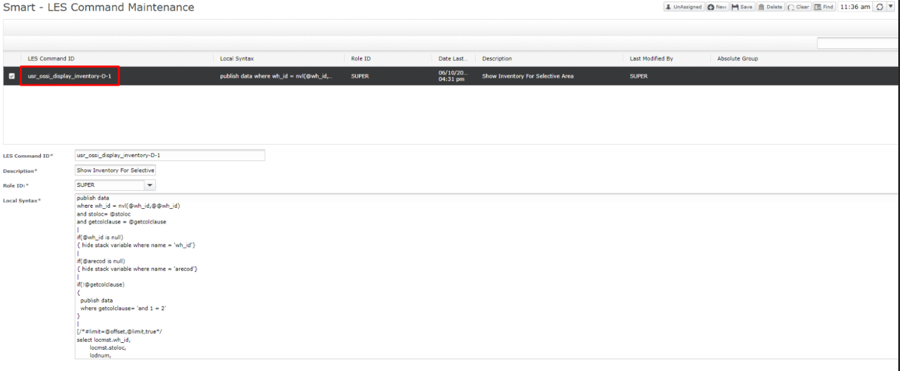

#### Action Commands

Action commands are specific instructions associated with main commands. They define the actions that can be performed on the data. The format for an action command ID is typically `<Main-CMD>-A-1`, `<Main-CMD>-A-2`.

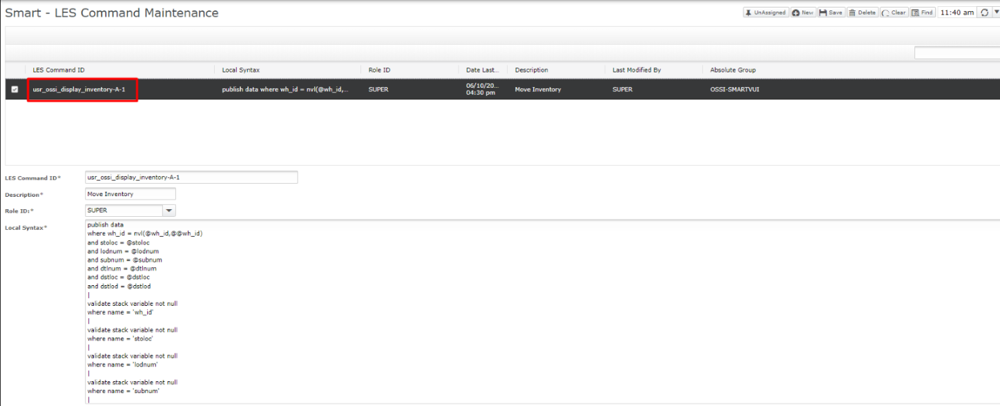

#### Add New Fields

If there a new field needed to be added in any LES Command Maintenance screen, It’s data must be added in the below tables. A field’s type must be specified i.e Combo Box, Date/Time or Flag.
 - les_var_config
 - les_lkp
 - les_var_vp

1. In les_var_config table a field name, description and its type must be defined. If a field with the name “tray_box” is required, its data must be added in the “les_var_config” table like given below.

    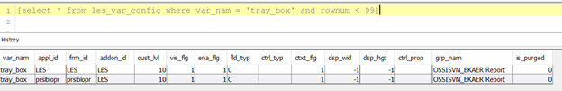

2.	ii.	In les_var_vp table a Lookup ID is created in lkp_id column.  User has to insert record in les_var_vp table manually as shown in the below screenshot.

    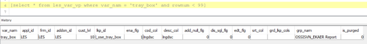

3. iii.	In les_lkp table a command or SQL statement must be created for that field in lkp_cmd column against relevant lkp_id as given below.

    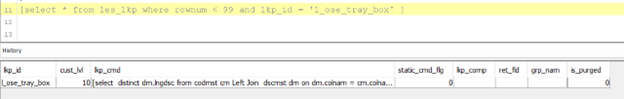

Below is the SQL statement which has been added in “lkp_cmd” column of “les_lkp” table.

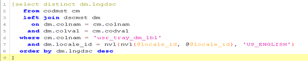

Lookup Field is shown in Smart Viu.

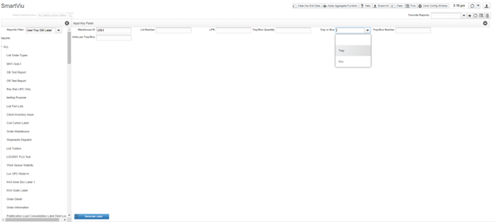

#### Multi Selection
Multi selection is applicable in Smart Viu on Drop-down field. If user wants to add a report which consists of multi selections, there are some changes need to be made in LES Command script. Below is an example of Multi selection.

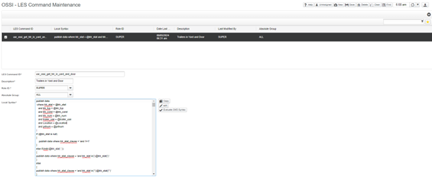

In the below screenshot multi selection is shown on Smart Viu. Click on Find button.

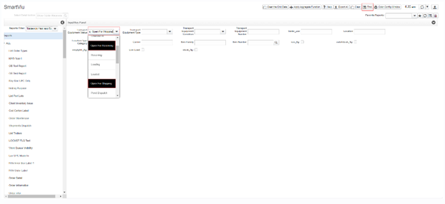

When user clicks on Find the data is displayed in the main grid for relevant selected record.

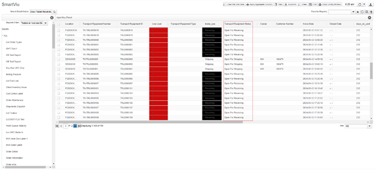

### CRUD Functionalities

### Add New LES Command

1. Click on the "New" button to add a new LES Command.
2. Enter the required information for the new LES command like LES command ID, description, etc.
3. Assign a role to the LES Command from the dropdown menu. Users can add multiple roles to a single LES Command.
4. Write the MOCA Script in the local syntax field and make sure you follow the format for writing the script for LES Commands.
5. Click on the "Save" button to add the LES Command.

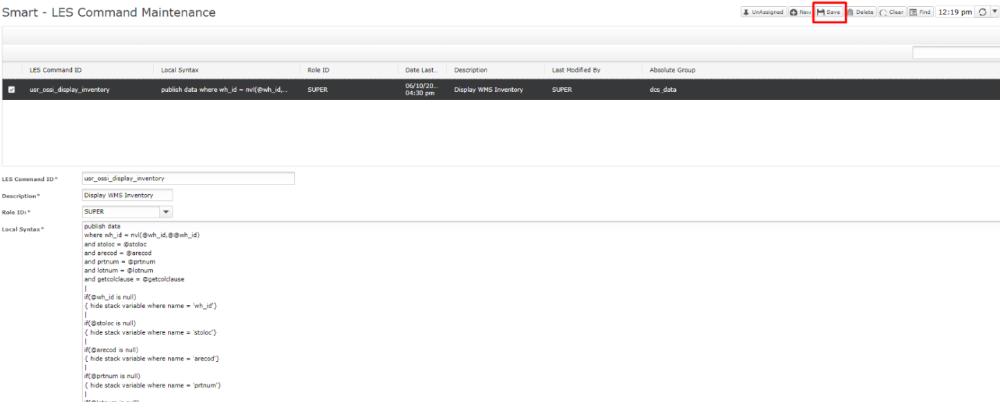

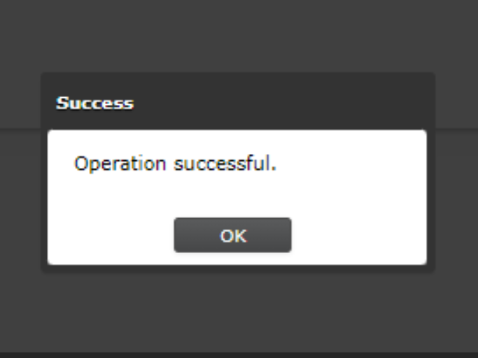

### Delete LES Command

1. Click on the "Find" button to load the LES command record in the grid.
2. Select a record from the grid.
3. Click on the "Delete" button to delete this command.
4. This will delete the LES command as well as the role assigned to the LES command.

### Update LES Command

1. Click on the "Find" button and select a record from the grid which you want to update.
2. Edit the required fields like local syntax or descriptions.
3. Click on the "Save" button and the data will be updated.

### Unassign Role for LES Command

1. Click on the "Find" button to load the LES command record in the grid.
2. Select a record from the grid.
3. Click on the "Unassign" button to unassign the roles from the selected LES command.
4. Now, the role for the selected LES command is removed.
