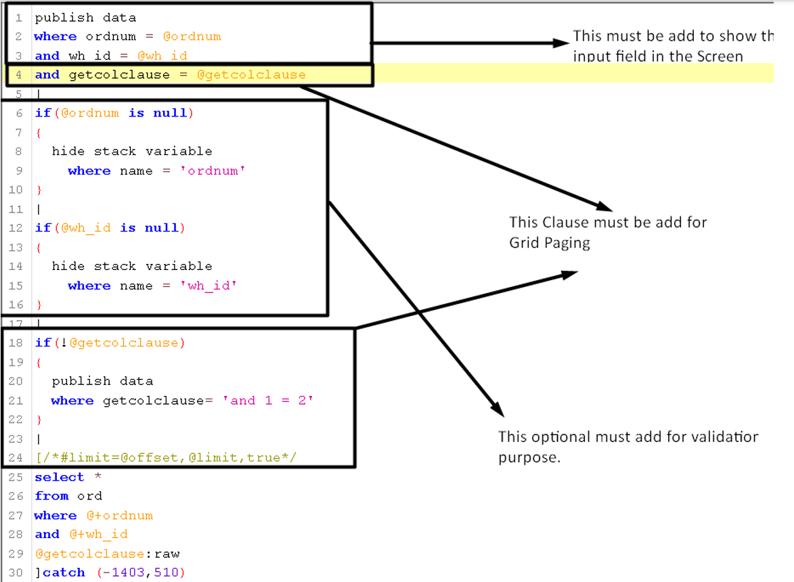
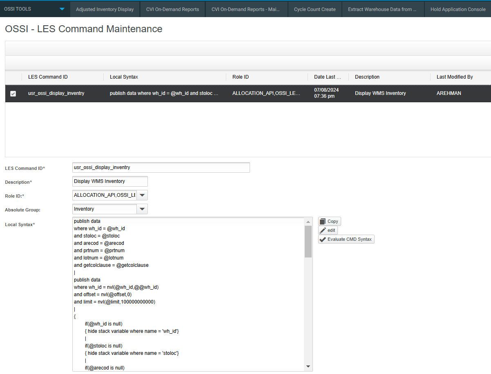
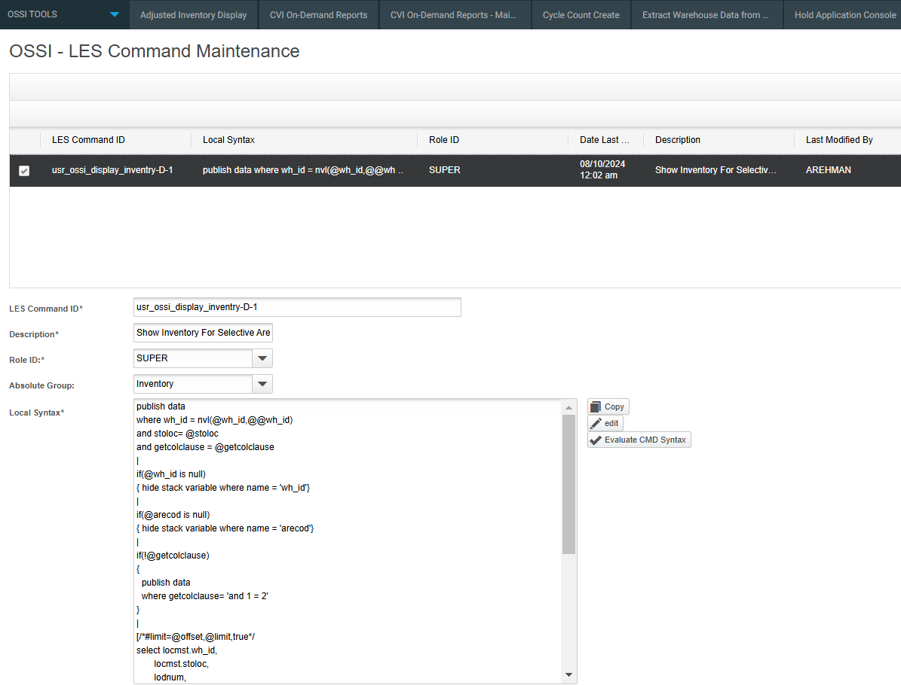
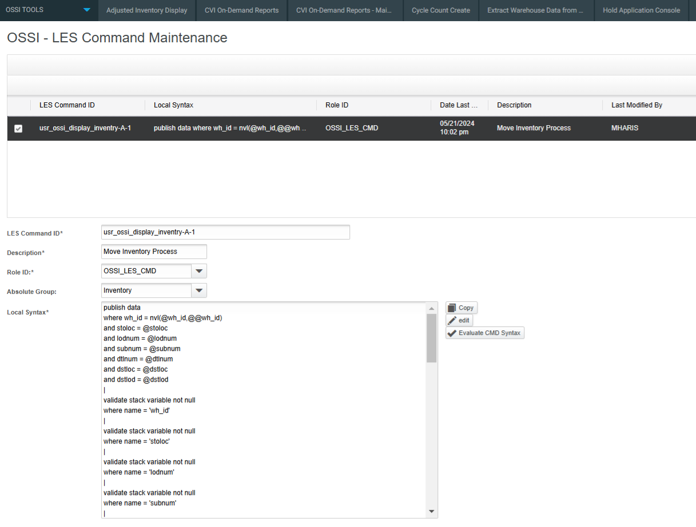
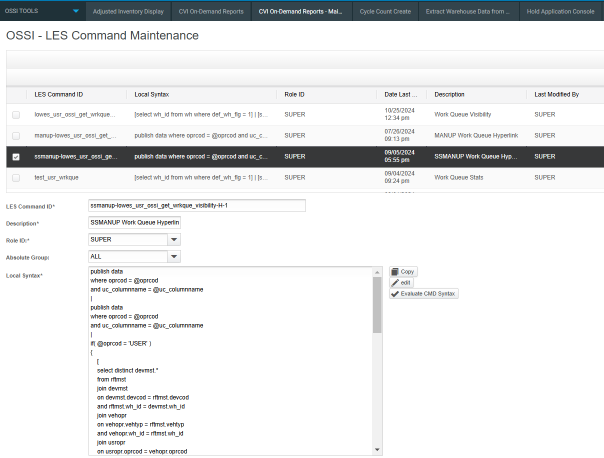
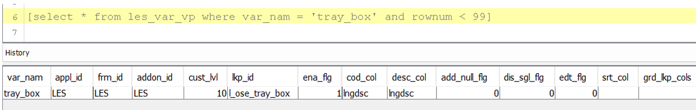
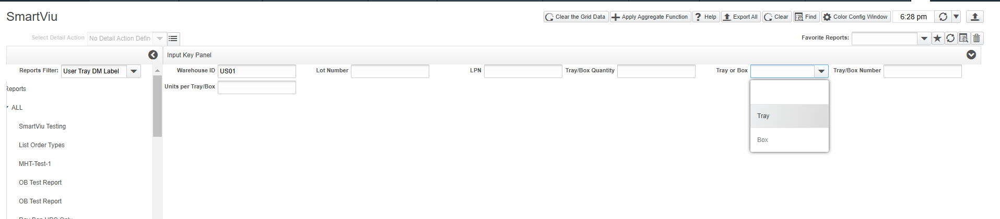
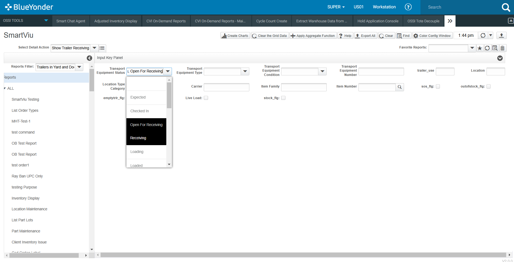
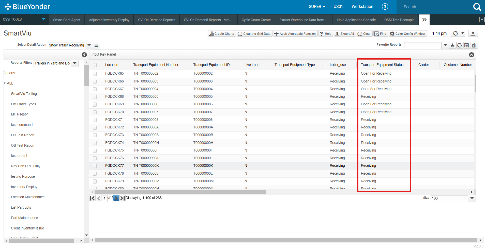
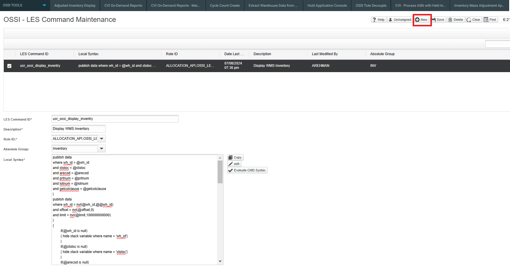

# SmartViu Bundles

## Overview

SmartViu consists of two primary screens: 
- **Maintenance Screen** 
- **SmartViu Screen**.

### LES Command Maintenance Screen

This screen is designed for administrators or users with appropriate roles to manage LES commands. The key functionalities include:
- **Creating** new LES commands.
- **Updating** existing commands.
- **Deleting** commands when no longer needed.
- **Assigning roles** to LES commands.

This forms the foundation for managing reports within SmartViu.

### SmartViu Screen

The SmartViu Screen is used by end-users to interact with the reports configured through the Maintenance Screen. It provides:
- A **user-friendly interface** to view report lists.
- Options to **perform actions on grid data**.
- Enhanced **data visualization features**, including grid coloring.

Together, these two screens provide a seamless environment for report management within the Blue Yonder WMS ecosystem.


### LES CMD Script Format

To ensure consistency and proper execution, users must adhere to a predefined script format when writing LES commands.

#### How to Write Scripts

LES command scripts are categorized into three types:
1. **Main Commands** – Define primary operations.
2. **Action Commands** – Specify executable actions.
3. **Detail Commands** – Provide additional configurations and data breakdowns.

Following the correct format for these commands ensures optimal performance and seamless integration within SmartViu.




#### Main Commands

Main commands are the primary instructions used to manage LES commands within SmartViu. Users must define the main command with the above-mentioned format. Users also follow the format for defining each main command ID such as `<Main-CMD>`.


</br>

**LES Main Command To Display Inventory**

```sql
publish data 
where wh_id = @wh_id
and stoloc = @stoloc
and arecod = @arecod
and prtnum = @prtnum
and lotnum = @lotnum
and getcolclause = @getcolclause
|
publish data
where wh_id = nvl(@wh_id,@@wh_id)
and offset = nvl(@offset,0) 
and limit = nvl(@limit,100000000000)
|
{
	if(@wh_id is null)
	{ hide stack variable where name = 'wh_id'}
	|
	if(@stoloc is null)
	{ hide stack variable where name = 'stoloc'}
	|
	if(@arecod is null)
	{ hide stack variable where name = 'arecod'}
	|
	if(@prtnum is null)
	{ hide stack variable where name = 'prtnum'}
	|
	if(@lotnum is null)
	{ hide stack variable where name = 'lotnum'}
	|
	if(!@getcolclause)
	{ 
	  publish data 
	  where getcolclause= 'and 1 = 2'
	}
	|
	[
	select locmst.wh_id,
	       locmst.stoloc,
	       supnum,
	       lodnum,
	       dtlnum,
	       subnum,
	       prtnum,
	       prt_client_id,
	       ftpcod,
	       orgcod,
	       revlvl,
	       invsts,
	       untqty,
	       fifdte,
	       mandte,
	       expire_dte
	from inventory_view
	join locmst
	on locmst.stoloc = inventory_view.stoloc
	and locmst.wh_id = inventory_view.wh_id 
	where @+locmst.wh_id
	and @+locmst.stoloc
	and @+arecod
	and @+prtnum
	and @+lotnum
	@getcolclause:raw
	]catch (-1403,510)
}  
```

#### Detail Commands

Detail commands provide additional configuration and details for each main command. They extend the functionality and customization of main commands. The format for a detail command ID is typically `<Main-CMD>-D-1`, `<Main-CMD>-D-2`.


</br>

**LES Detail Command**

``` sql
publish data 
where wh_id = nvl(@wh_id,@@wh_id)
and stoloc= @stoloc
and getcolclause = @getcolclause
|
if(@wh_id is null)
{ hide stack variable where name = 'wh_id'}
|
if(@arecod is null)
{ hide stack variable where name = 'arecod'}
|
if(!@getcolclause)
{ 
  publish data 
  where getcolclause= 'and 1 = 2'
}
|
[/*#limit=@offset,@limit,true*/
select locmst.wh_id,
       locmst.stoloc,
       lodnum,
       dtlnum,
       subnum,
       prtnum,
       prt_client_id,
       ftpcod,
       orgcod,
       revlvl,
       invsts,
       untqty 
from inventory_view
join locmst
on locmst.stoloc = inventory_view.stoloc
and locmst.wh_id = inventory_view.wh_id 
where @+locmst.wh_id
and @+locmst.stoloc
@getcolclause:raw
]catch (-1403,510)
``` 

#### Action Commands

Action commands are specific instructions associated with main commands. They define the actions that can be performed on the data. The format for an action command ID is typically `<Main-CMD>-A-1`, `<Main-CMD>-A-2`.


</br>

**LES Action Command**

```sql
publish data 
where wh_id = nvl(@wh_id,@@wh_id)
and stoloc = @stoloc
and lodnum = @lodnum
and subnum = @subnum
and dtlnum = @dtlnum
and dstloc = @dstloc
and dstlod = @dstlod
|
validate stack variable not null 
where name = 'wh_id'
|
validate stack variable not null 
where name = 'stoloc'
|
validate stack variable not null 
where name = 'lodnum'
|
validate stack variable not null 
where name = 'subnum'
|
validate stack variable not null 
where name = 'dtlnum'
|
validate stack variable not null 
where name = 'dstloc'
|
if (@dstloc is not null)
{
    [
    select count(*) dstcnt
    from dual
    where exists( 
                select 'X' 
                from locmst 
                where stoloc = @dstloc 
                and wh_id = @wh_id
                )
    ]
    |
    if ( @dstcnt = 0 )
    {
        set return status 
        where status = '8585858585858'
    }
}

```

#### HyperLink Commands
Hyperlink is used to allow users to easily navigate from main grid to another popup screen based on a column name.  
The format for a Hyperlink is typically <COLUMN1-Main-CMD>-H-1, < COLUMN2-Main-CMD>-H-2 

For example: 
LES Command ID = ordnum-usr_ossi_test_ord_new-H-1 

Ordnum: Column name is used for hyperlink 

usr_ossi_test_ord_newn: Main LES Command ID 

H-1: It represents the first Hyperlink  

</br>

**LES HyperLink Command**

```sql
publish data 
  where btcust = @btcust 
    and wh_id = @wh_id
    and getcolclause = @getcolclause 
|
if(!@getcolclause)
{ 
  publish data 
  where getcolclause= 'and 1 = 2'
}
|
[
/*#limit=@offset,@limit,true*/
select * 
from cstmst 
where @+cstnum^btcust
@getcolclause:raw
]catch(-1403,510) 
|
filter data where moca_filter_level = '1' 
and btcust = @cstnum
;
```
#### Add New Fields

If there a new field needed to be added in any LES Command Maintenance screen, It’s data must be added in the below tables. A field’s type must be specified i.e Combo Box, Date/Time or Flag.
 - les_var_config
 - les_lkp
 - les_var_vp

1. In les_var_config table a field name, description and its type must be defined. If a field with the name “tray_box” is required, its data must be added in the “les_var_config” table like given below.


</br>

2.	In les_var_vp table a Lookup ID is created in lkp_id column.  User has to insert record in les_var_vp table manually as shown in the below screenshot.


</br>

3. In les_lkp table a command or SQL statement must be created for that field in lkp_cmd column against relevant lkp_id as given below.


</br>

Below is the SQL statement which has been added in “lkp_cmd” column of “les_lkp” table.


</br>


Lookup Field is shown in Smart Viu.


</br>

#### Multi Selection
Multi-selection is supported in SmartViu for drop-down fields. If a user wants to add a report that includes multiple selections, some changes need to be made in the LES Command script. Below is an example of multi-selection.


</br>

In the below screenshot multi selection is shown on Smart Viu. Click on Find button.


</br>
There are some changes need to be made in LES Command script for Multi Selection. 

 ```sql
 publish data
 where trlr_stat = @trlr_stat
   and trlr_typ = @trlr_typ
   and trlr_cond = @trlr_cond
   and trlr_num = @trlr_num
   and trailer_use = @trailer_use
   and Location = @Location
   and loc_typ_cat = @loc_typ_cat
   and carcod = @carcod
   and prtfam = @prtfam
   and getcolclause = @getcolclause
   and getcolclause = @getcolclause
   and prtnum = @prtnum
   and sos_flg = @sos_flg
   and outofstock_flg = @outofstock_flg
   and emptytrlr_flg = @emptytrlr_flg
  and live_load_flg = @live_load_flg
   and stock_flg = @stock_flg
   
|
if (@trlr_stat is null)
{
    publish data where trlr_stat_clause = 'and 1=1'
}
else if(instr(@trlr_stat,','))
{publish data where trlr_stat_clause = 'and trlr_stat in('||@trlr_stat||')'

}
```


### CRUD Functionalities

### Add New LES Command

1. Click on the "New" button to add a new LES Command.
2. Enter the required information for the new LES command like LES command ID, description, etc.
3. Assign a role to the LES Command from the dropdown menu. Users can add multiple roles to a single LES Command.
4. Write the MOCA Script in the local syntax field and make sure you follow the format for writing the script for LES Commands.
5. Click on the "Save" button to add the LES Command.


</br>


</br>


### Delete LES Command

1. Click on the "Find" button to load the LES command record in the grid.
2. Select a record from the grid.
3. Click on the "Delete" button to delete this command.
4. This will delete the LES command as well as the role assigned to the LES command.


### Update LES Command

1. Click on the "Find" button and select a record from the grid which you want to update.
2. Edit the required fields like local syntax or descriptions.
3. Click on the "Save" button and the data will be updated.


### Unassign Role for LES Command

1. Click on the "Find" button to load the LES command record in the grid.
2. Select a record from the grid.
3. Click on the "Unassign" button to unassign the roles from the selected LES command.
4. Now, the role for the selected LES command is removed.

