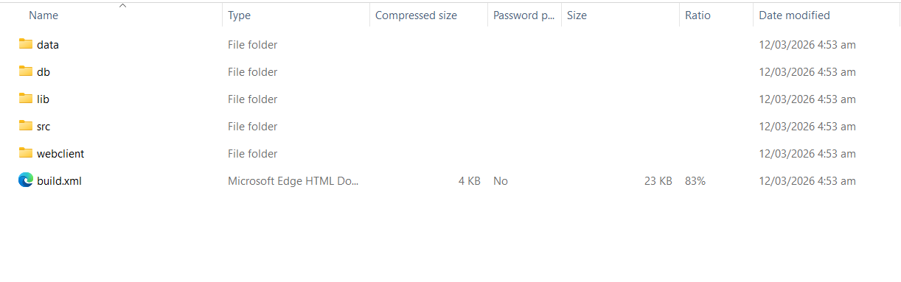
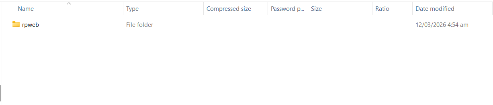
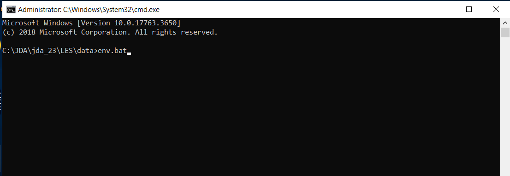
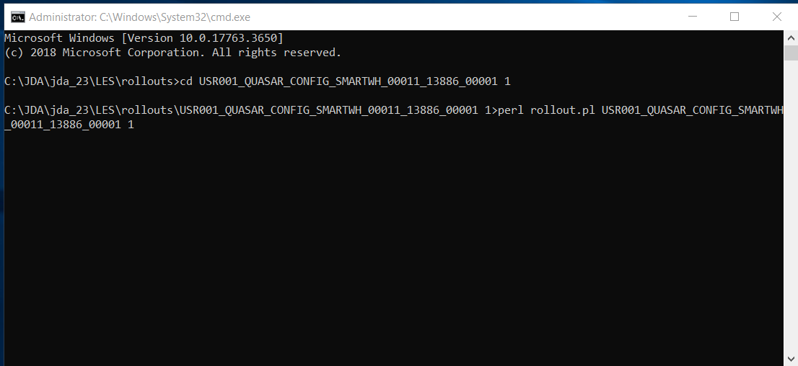
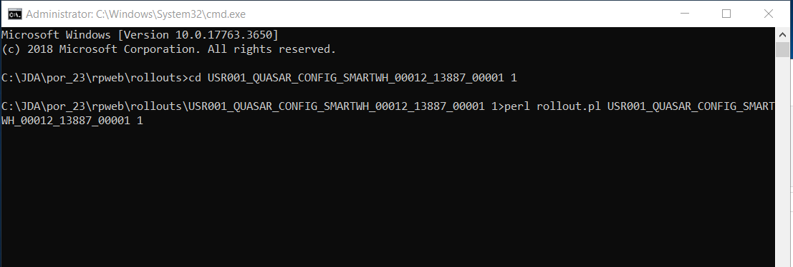

# Installation Guide 

This guide provides step-by-step instructions for installing SmartViu using rollout packages for systems using LES and REFS.

Follow the steps in order to ensure a successful deployment.

## Prerequisites

Before beginning the installation, ensure that all of the following conditions are met:

- You have administrator access on the server.
- All active sessions are closed and no users are connected to the system.
- The rollout package has been received and named appropriately according to the naming conventions.
- You are familiar with the relevant environment variables, such as %LESDIR% (for LES) and %rpweb% (for REFS).
- Before proceeding, stop all running RedPrairie services, including both the server and the portal services, to avoid conflicts during installation.

## Installation Instructions

### 1. Move the Rollout Contents

Before copying the files, ensure you can identify the rollout folders for each 
environment. 

The screenshots below show examples of the LES and REFS rollout 
package structure.

  
   

*The LES rollout package contains these backend folders in pkg.*

  
   

*The REFS rollout package contains this frontend folder in pkg.*

Copy the rollout package contents into the correct target directories for each environment:

•	**For LES (Backend)**: Copy the rollout folders into the LES rollout directory and unzip the folder:
             `LESDIR\rollout\`

•	**For REFS (Screen/Frontend)**: Copy the rollout folders into the REFS rollout directory and unzip the folder:
`rpweb\rollout\`

Ensure the folder names match the rollout package names exactly as received.

### 2. Open the Command Line
Open cmd terminal and run as Administrator.

Ensure that the environment is properly set before executing any rollout scripts this includes verifying that the required environment variables (%LESDIR%, %rpweb%) are loaded and accessible in the session.

### 3. Run env.bat

Before installing the rollout run the script `env.bat` in 
`cd %LESDIR%\data`.

  
   

### 3. Run the LES Rollout
Follow the steps below for each LES rollout folder:

1.	**Navigate to the rollout directory**:

     Change to the specific rollout folder inside the LES rollout path:
    `cd %LESDIR%\rollout\<rollout_name>`

2.	**Execute the rollout script**: Run the Perl rollout script, passing the rollout name as an argument:
`perl rollout.pl <rollout_name>`

  
   

 The rollout will start installing in your system.

3.	**Check the log file**: After execution, review the generated log file in the log directory for the rollout name. Look for any errors or warnings that may require attention.

Repeat Steps 1–3 above for all remaining LES rollout folders before moving on to REFS.

### 4. Run the REFS Rollout
Before installing the rollout run the script `env.bat` in 
`cd %REFS%\rpweb`.

Follow the steps below for each REFS rollout folder:

1.	**Navigate to the rollout directory**: Change to the specific rollout folder inside the REFS rollout path:

    `cd %rpweb%\rollout\<rollout_name>`

2. **Execute the rollout script**: Run the Perl rollout script:
    `perl rollout.pl <rollout_name>`

    

    
    

    The rollout will start installing in your system.

3. 	Check the log file: Review the generated log file in the log directory for any errors

> **Note:** In case of success or warning messages, check the install.log file inside the install folder for details.

### 5. Post-Rollout Database Load
Once both the LES and REFS rollouts have been completed successfully:

1.	Navigate to the rpweb BIN directory:

    `cd %rpweb%\BIN`

2.	Run the **DB load** command from the command prompt to apply all database changes included in the rollout package.

## Post Installation Steps
After the rollout and database load are complete, bring the services back up.

Restart all RedPrairie services that were stopped in the Prerequisites section, including both the server and portal services.
 
Verify that all services start successfully without errors.

---