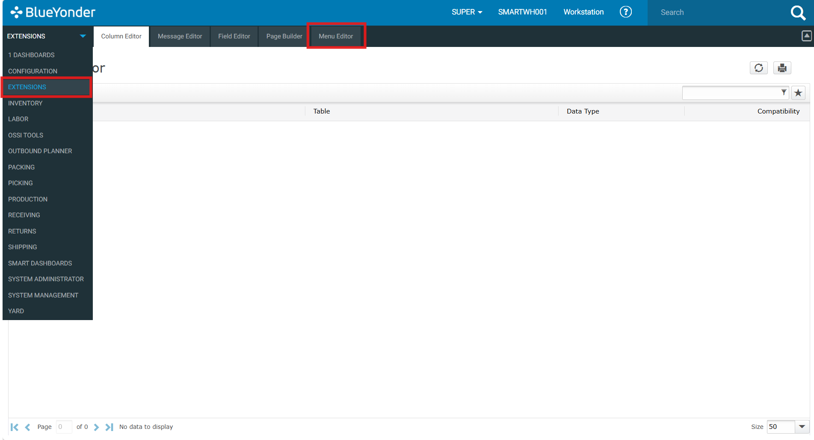
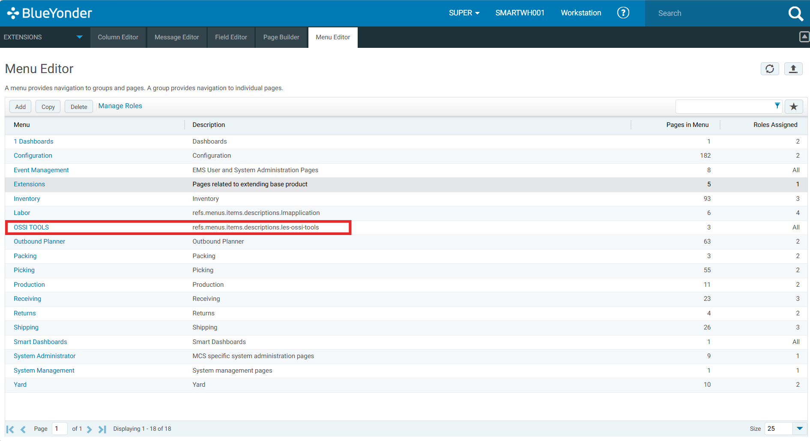
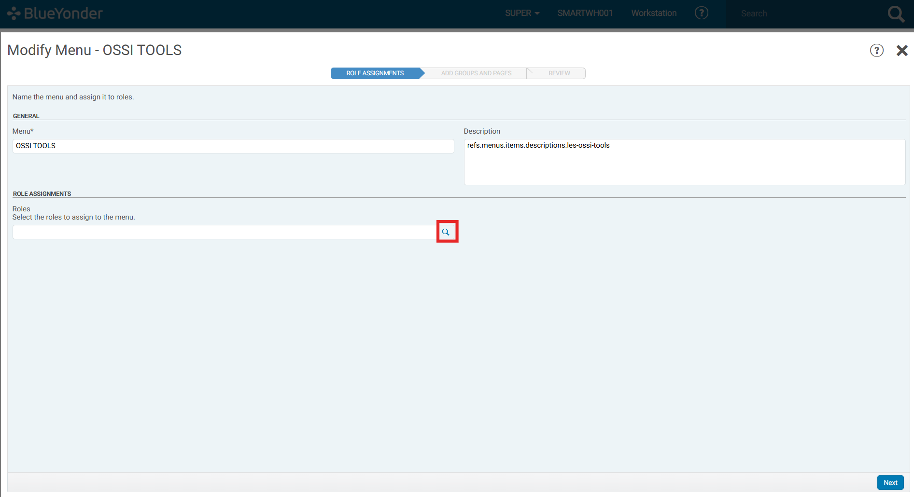
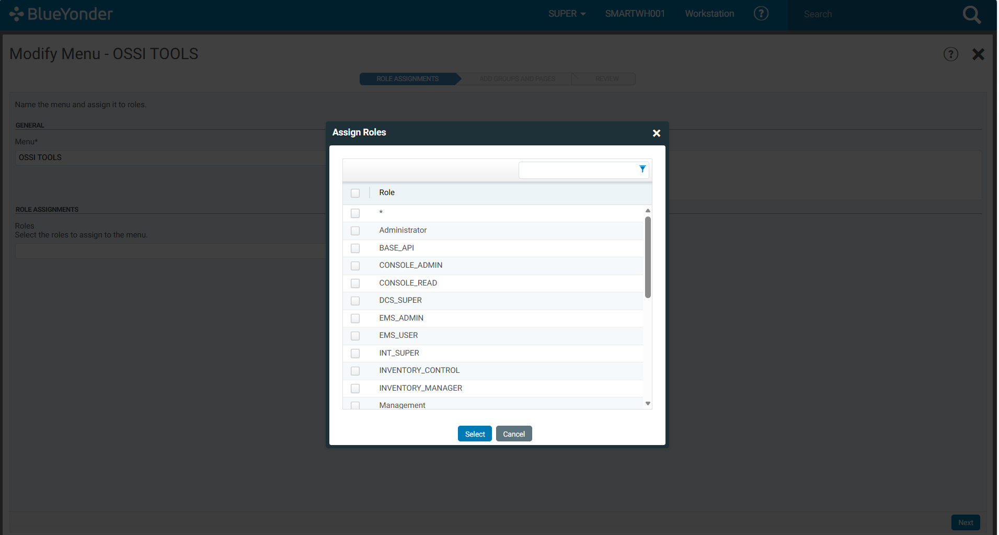

# Controlling Menu Access

This guide explains how to control which users can see a Smart Viu and LES Command Maintenance in menu item.

Follow the steps mention below: 

1. Navigate to the Menu Editor from Extensions tab form the main navigation.

    
    

2. Locate the menu group you want to control access for. In this case we will select OSSI Tools. Click on it to open its settings.

    
    

3. Inside the menu item settings, click on the Role Assignments tab.

    
    

4. A list of available roles will appear. Select the role(s) you want to grant visibility to for SmartViu and LES Command Maintenance.

    
    

5. Save your changes.

---