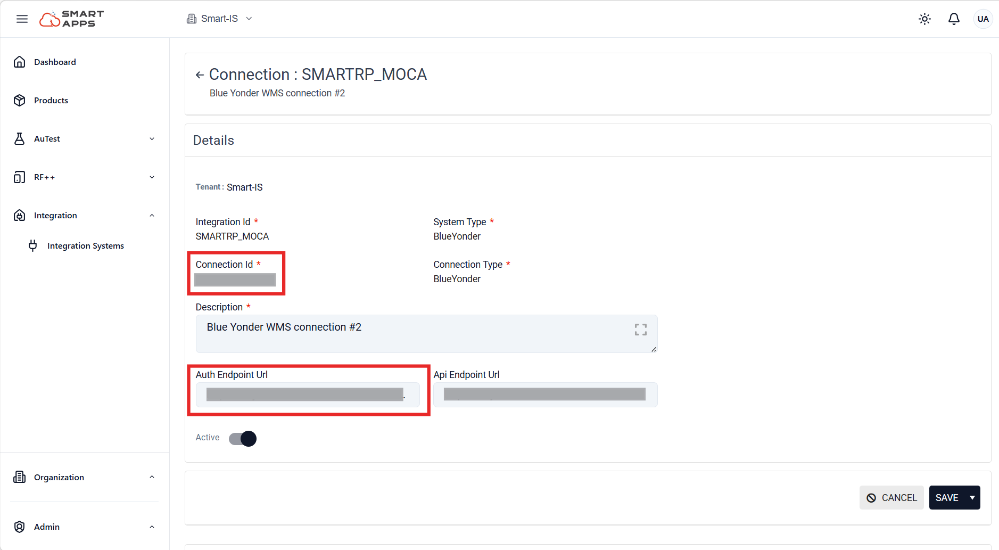

# Policy Setup 

To begin working with SmartViu, it is essential to set the necessary policies.

This document provides a comprehensive guide to all the required policies, along with examples and explanations to help you get started.

## Policies for Smart Assitant 

To successfully enable and operate Smart Assistant within Smart VIU, the following policies and configurations must be ensured:

### Enabling Smart Assistant Policy

To enable or disable the Smart Assistant feature, configure the following policy:

| polcod                  | polvar       | polval       | rtnum1                        |
|-------------------------|--------------|--------------|---------------------------------|
| USR-SMARTBASE     | UC-APP-CONG   | ENABLED            |1  | 

  -  `rtnum1=1` → enabled (ON)
-  `rtnum=0` → disabled (OFF)

### Tenant Key Setup Policy

To configure the tenant key for Smart Assistant, use the following policy:

| polcod                  | polvar       | polval       | rtstr1                       |
|-------------------------|--------------|--------------|---------------------------------|
| USR-SMARTBASE     | UC-APP-CONG   | SA-TENANT-KEY            |Tenant ID   | 

### Server Setup Policy

To configure the Smart Assistant server connection, use the following policy:

| polcod                  | polvar       | polval       | rtstr1                       |
|-------------------------|--------------|--------------|---------------------------------|
| USR-SMARTBASE     | UC-APP-CONG   | SERVER_ID            | Server id / Connection id   |

**Server Configuration**

1. Open the **Smart Apps Integration** section from [Smart Apps](https://apps.smart-is.com/). 

2. Create a new system configuration.
3. Configure the required connection settings.
4. Copy the generated connection ID.

    
    

5. Add the required service links in the API Endpoint URL section.

### URL Setup Policy 

To configure the Smart Assistant URL, use the following policy:

| polcod                  | polvar       | polval       | rtstr1                       |
|-------------------------|--------------|--------------|---------------------------------|
| USR-SMARTBASE     | UC-APP-CONG   | URL            | https://ois-ai-wms.azurewebsites.net/v1/warehouse/   |

----