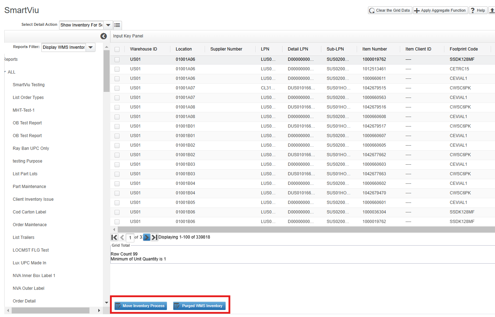
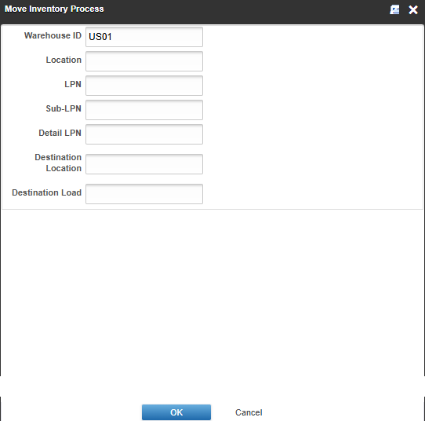
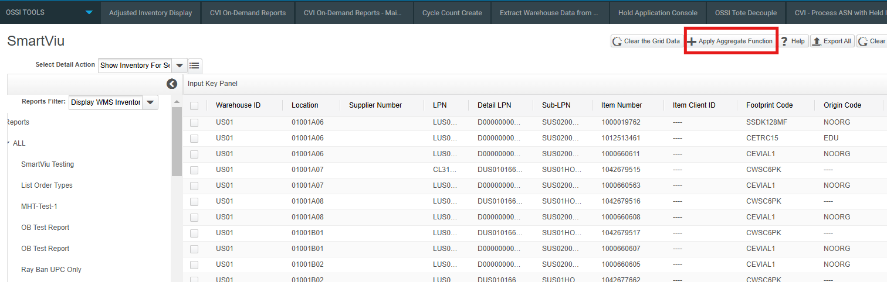

# SmartViu Screen

## Overview

The SmartViu screen is designed for end-users to easily view and work with the reports created in the Maintenance Screen. It has a simple and user-friendly layout that lets you view report lists, interact with grid data, visualize main grid details, and use enhanced data visualization features like grid coloring functionalities.

## View Report List and Report Data

To view the report list in SmartViu:

1. Click on the Reports Filter drop-down or Reports Tree that will show the available reports. 
2. Users can only view those reports which they are authorized to see. For example, if an LES command is assigned a SUPER role, the user can see the report in the Reports Filter drop-down field or Reports Tree only if the user has the SUPER role assigned.

 

3. Select a report from the available report list, and input fields will be drawn dynamically for that report.

 

*Note: These input fields are created for each LES command based on the publish statement at the top of the MOCA script.*

 

4. Click on the "Find" button to load the report data in the grid, or you can fill out input fields to find data based on the given input parameters.

 

Users can also add frequently used reports to favorite reports, by clicking the star button. Those reports will show in favorite reports after clearing the data. 

 

 

## View and Process Detailed Actions

To view and process detailed actions for a record:

1. Navigate to the main grid and select the record you wish to view details for by clicking on it.
2. After selecting the record, choose the detail report from the "Select Detail Action" lookup field. A popup window will appear; select any detail report from the list, and it will display the detail/child grid of the selected record.

 

Choose an action: By default, the first action in the Detail Action lookup is selected. If you wish to perform a different action, select it from the action lookup available list.

 

## View and Process Grid Actions

The Grid Action Lookup allows you to perform various actions on selected data from the main grid. Follow these steps to use this feature:

1. Navigate to the main grid and select the record you wish to perform an action on by clicking on them.
2. Area below the grid is used for actions buttons. If the selected record needs to be processed as Move inventory, then select the below button “Move Inventory Process” button or to the record need to be deleted select “Purged WMS Inventory” button.

 

A new pop-up window will open. Here, you need to provide the required input parameters to perform the selected action. For example, if you want to move inventory, you will need to provide the destination load and destination location where the inventory will be moved.

 
 
After providing the necessary information, confirm and execute the action by clicking on the "OK" button.

## View and Process Hyperlink

1. Select and open the report for which Hyperlink is created. Click on Find button to show the data.

 

2. If click on any value, it will show another popup page containing a grid with data.

  

## Grid Coloring Functionality

The grid coloring functionality in the SmartViu screen helps you visualize report data more effectively. Coloring is applied based on specific criteria for each column or row in the main grid, allowing you to quickly identify important information.

To apply grid coloring:

1. Select a record from the main grid.
2. Click on the “Color Config Window” button.

  

A new pop-up window will open where you can define the criteria for applying color coding to the grid.

  

In the pop-up window, you can add, update, or delete criteria for grid coloring using the respective buttons:

- To add a new criterion, first fill out all the required fields and click on the "Add" button.
  - **Grid Field Name**: This dropdown field contains all the grid columns where you want to apply the color coding. e.g., Item Number
  - **Select Operation**: This dropdown field contains comparison operators. Choose an operation from the dropdown menu. Select “=” for string comparison. e.g., "="
  - **Compare Fields**: Enter the value to compare against the selected grid field name. e.g., "CHIPS"
  - **Set User Level Or LES Level**: Choose between "User Level" or "LES Level".
    - **User Level**: Check the "User Level" checkbox to enable coloring only for the user who added the criteria (e.g., a super user).
    - **LES / Instance Level**: Check the "LES Level" checkbox to enable coloring for all users.
  - **Back Color**: Choose the color for the grid coloring rule. By default, it is black.
  - **Foreground Color**: This filed is used to choose the Foreground Color for grid coloring rule.
  - **Apply to Entire Row**: Check this checkbox to apply the grid coloring to the entire row. If unchecked, coloring will be applied only to the specified column.

 
  

For example, in the above screenshot, grid coloring is applied to the entire row that has item number "1000660616", and this rule is set at the User Level (e.g., only the SUPER user will see this grid rule).

Now, check the grid coloring applied to the main grid.

 
  

- **Update**: This button is used to modify an existing rule.
- **Delete**: Click the "Delete" button to remove the selected grid rule.

*Note: Ensure that you have defined clear and specific criteria for each column or row to make the grid coloring meaningful and helpful.*

Using this grid coloring functionality enhances the readability of your data reports and allows you to quickly identify critical information based on the criteria you set.

## Top Bar Menu

Some action buttons are available on the top menu of the SmartViu screen.

- **Clear Grid Data**: The "Clear Grid Data" button clears the grid data and makes input fields visible for searching criteria.
- **Clear Refresh**: The "Grid Refresh" button is used to reloads the grid data.
- **Grid Settings**: The Grid Settings action button functions similarly to the bottom bar Color Configuration Window button, allowing you to set up criteria for grid coloring based on specific conditions. This feature enhances the visualization of report data, making it easier to identify important information.
- **Find**: The “Find” button is used to load the main report data into the grid. This functionality allows you to easily view the data for a selected report.
- **Clear**: The “Clear” button is used to remove all data from the SmartViu screen and reload the entire screen. This functionality helps in resetting the view and starting fresh.
- **Export All**: The “Export” button allows you to export the data from the main grid into a CSV file. This functionality is useful for saving data locally and sharing or analyzing it in other applications.
- **Help**: The “Help” button is used for user guide.
- **Grid Coloring Functionality**: The grid coloring functionality in the SmartViu screen helps you visualize report data more effectively. Coloring is applied based on specific criteria for each column or row in the main grid, allowing you to quickly identify important information.
- **Apply Aggregat Function**: The “Apply Aggregate Function” button is used to apply any aggregate function on the grid.
1. Select a report from the list and load the data in grid, navigate to Apply Aggregate Function button.

     
  

2. In this case aggregate function is going to be created on Order Quantity column. The below screen is shown.

    
  

3. Select an integer field from the drop down to get the stats against the selected field. e.g.  Order Quantity

     
  

4. Select any aggregate function from Group Function drop down menu.

     
  

5. Click on Add Criteria button.

     
  

6. Criteria is created in the below screen. Click on Confirm button to apply the criteria.

     
  

7. When Confirm button is clicked. Criteria will be applied. In Gid Total the count and total is calculated.

     
  

